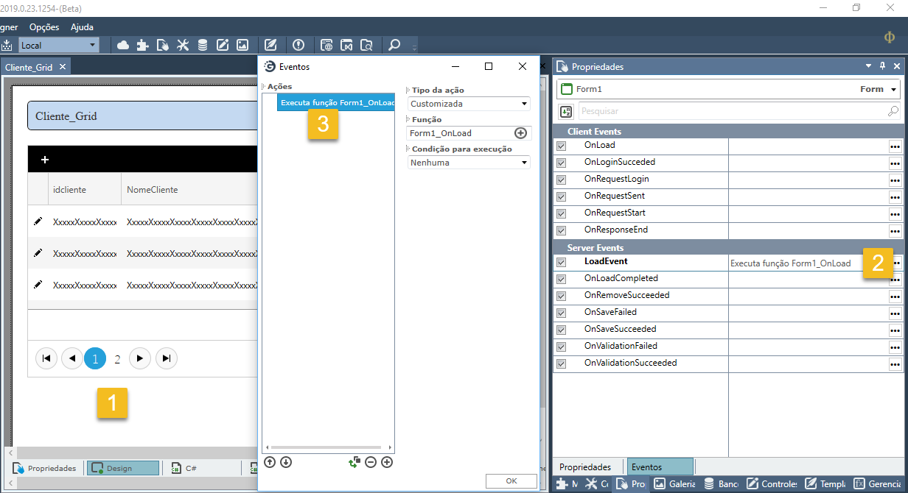
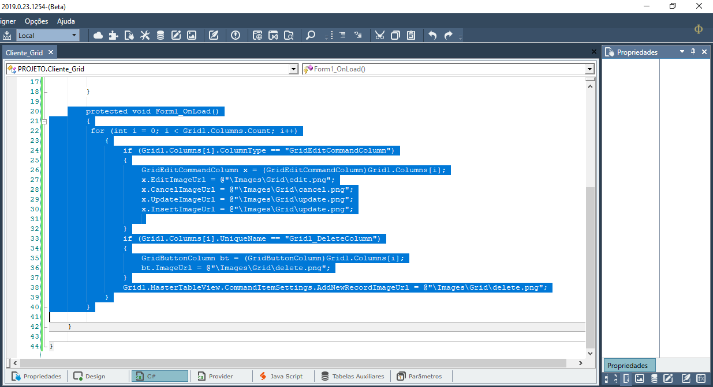
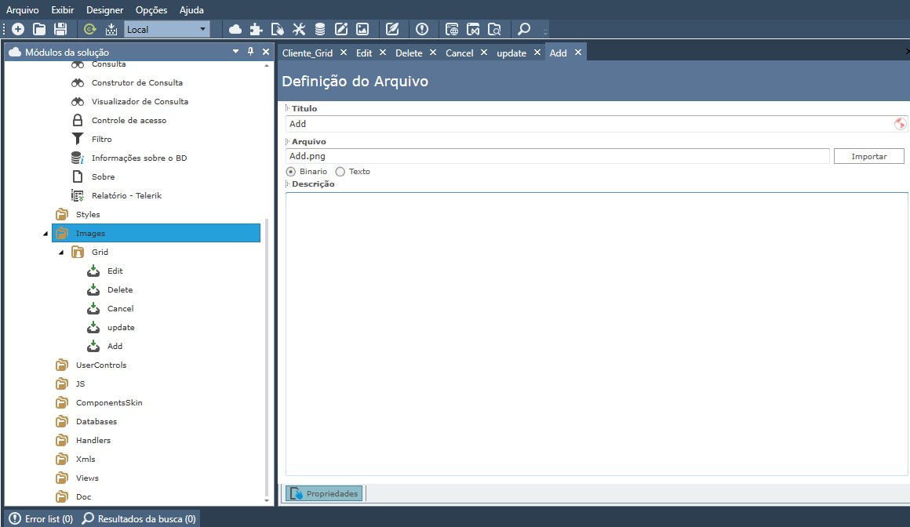

# Exemplo de como alterar icones padrão do Grid
Este exemplo, tem por objetivo, apresentar uma forma fácil para alterar os icones do grid. É muito fácil.
<br>
Procedimentos:
<br>
* Abra a janela de dados desejada;
* Abra a tela de propriedades/Eventos;
* Crie um evento de server em FormLoad;
* Crie um evento Customizado de código C#;


<br>
Agora, crie uma função com o seguinte código:
<br>
```
	protected void Form1_OnLoad()
        {
         for (int i = 0; i < Grid1.Columns.Count; i++)
            {
                if (Grid1.Columns[i].ColumnType == "GridEditCommandColumn")
                {
                    GridEditCommandColumn x = (GridEditCommandColumn)Grid1.Columns[i];
                    x.EditImageUrl = @"\Images\Grid\edit.png";
                    x.CancelImageUrl = @"\Images\Grid\cancel.png";
                    x.UpdateImageUrl = @"\Images\Grid\update.png";
                    x.InsertImageUrl = @"\Images\Grid\update.png";                
                }
                if (Grid1.Columns[i].UniqueName == "Grid1_DeleteColumn")
                {
                    GridButtonColumn bt = (GridButtonColumn)Grid1.Columns[i];
                    bt.ImageUrl = @"\Images\Grid\delete.png";
                }
                Grid1.MasterTableView.CommandItemSettings.AddNewRecordImageUrl = @"\Images\Grid\delete.png";
            }
         }
```
<br>
Dentro do Gvinci, irá ficar assim, na aba de código c#:


<br>
<br>
<br>
Adicione as imagens, dentro das pastas desejadas. Neste exemplo, criamos na pasta Imagens\Grid.

Pronto. seu projeto terá os botões do grid personalizados.
<br>

<br>
Você pode baixar o exemplo neste link:
[Alterar Icones do Grid.gvn](Alterar Icones do Grid.gvn "Alterar Icones do Grid.gvn")
